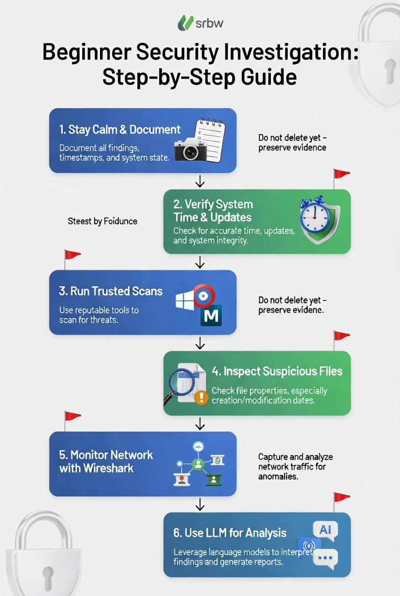
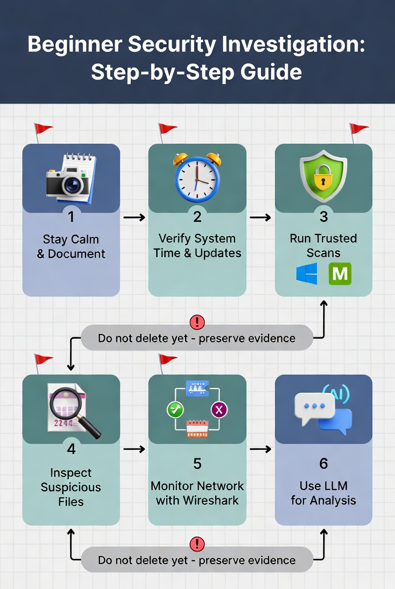

# Personal Security Walkthrough

A calm, beginner-friendly, open-source guide for documenting and investigating suspicious files and basic home-network activity — with clear paths to **escalate** when DIY investigation is no longer enough.

[](CONTRIBUTING.md)
[](LICENSE)

**Repository:** [github.com/Squirrel814/Personal_Security_Walkthrough](https://github.com/Squirrel814/Personal_Security_Walkthrough)  
**Part of:** [Interwoven Projects Community](https://github.com/Interwoven-Projects/Interwoven-Projects-Community)  
**Hub:** [Interwoven-Education](https://github.com/Interwoven-Projects/Interwoven-Education) (Cybersecurity pathway)

**This is educational self-help.** It is not legal advice, not certified digital forensics, and not a substitute for professional incident response.

---

## Who this is for

- Someone who noticed **weird files** (future timestamps, odd names, possible scare tactics) and wants to proceed safely
- People comfortable using an **LLM as a co-pilot** (Grok, Claude, GPT, local Ollama, etc.)
- Anyone who wants a **documented evidence package** before contacting a professional

No formal security background required. Willingness to document everything is the main prerequisite.

---

## Quick Start (5 minutes)

1. Read the [Quick Start Guide](Start-Guide/Quick-Start-Guide.md).
2. Pick the **Minimal Tools** framework for your OS (recommended for first-time use).
3. Copy the two [templates](Start-Guide/shared-templates/templates/) into a dated local folder (e.g. `Investigation_2026-06-27/`).
4. Paste your framework file into an LLM chat and begin **Phase 0** (document first — do not delete or run suspicious files).

| OS | Minimal Tools (start here) | Full Deep Dive |
|----|---------------------------|----------------|
| Windows | [minimal-tools/windows/](minimal-tools/windows/My_Security_Framework_Windows-OS_v1.1_Minimal_Tools.md) | [full-deep-dive/windows/](full-deep-dive/windows/My_Security_Framework_Windows-OS_v1.1_Full_Deep_Dive.md) |
| macOS | [minimal-tools/macos/](minimal-tools/macos/My_Security_Framework_macOS_v1.1_Minimal_Tools.md) | [full-deep-dive/macos/](full-deep-dive/macos/My_Security_Framework_macOS_v1.1_Full_Deep_Dive.md) |
| Linux | [minimal-tools/linux/](minimal-tools/linux/My_Security_Framework_Linux_v1.1_Minimal_Tools.md) | [full-deep-dive/linux/](full-deep-dive/linux/My_Security_Framework_Linux_v1.1_Full_Deep_Dive.md) |

---

## Minimal Tools vs Full Deep Dive

| | **Minimal Tools** | **Full Deep Dive** |
|---|-------------------|-------------------|
| **Goal** | Fast, low-friction first investigation | Thorough visibility when anomalies persist |
| **Extra installs** | Few or none (built-in tools first) | Free tools: Sysinternals, KnockKnock, Wireshark, ClamAV, etc. |
| **LLM token use** | Optimized for short prompts | Richer prompts and deeper analysis steps |
| **File inspection** | Properties / `stat` / Get Info | + ExifTool, extended attributes, recursive timestamp hunts |
| **Network** | `netstat`, `ss`, `lsof` basics | + Wireshark captures, filters, beaconing patterns |
| **Persistence hunting** | Light (Login Items, services list) | Autoruns, KnockKnock, LaunchAgents, cron, systemd |
| **Best when** | First concern, scare-tactic files, limited time | Clear red flags or you want maximum documentation |
| **Platforms** | Windows, macOS, Linux | Windows, macOS, Linux |

Both versions share the same core rules: **document before changing anything**, stay calm, and know when to stop.

---

## How the pieces fit together

See the full [Project Structure Recommendation](Start-Guide/shared-templates/templates/project_structure_recommendation.md) for screenshots, captures, and export subfolders.

```
Investigation_YYYY-MM-DD/
├── investigation_log_YYYY-MM-DD.md
├── suspicious_files_inventory_YYYY-MM-DD.md
├── screenshots/
├── network_captures/
└── tool_exports/
```

1. **Framework** (Minimal or Full Deep Dive) — paste into an LLM at the start of each session; it defines phases, comprehension gates, and safe commands.
2. **Templates** — [`investigation_log_template.md`](Start-Guide/shared-templates/templates/investigation_log_template.md), [`suspicious_files_inventory_template.md`](Start-Guide/shared-templates/templates/suspicious_files_inventory_template.md), and [`project_structure_recommendation.md`](Start-Guide/shared-templates/templates/project_structure_recommendation.md).
3. **Examples** — [`examples/`](Start-Guide/shared-templates/examples/) show realistic (redacted) entries.
4. **Meta framework** — [`My_Security_Investigation_Framework_v1.0.md`](My_Security_Investigation_Framework_v1.0.md) is a cross-platform paste-in context doc if you want one file that works with any LLM regardless of OS variant.

---

## When to escalate

If you see confirmed data theft, financial impact, sophisticated persistence, or feel personally targeted — **stop DIY work**.

1. **[When & How to Escalate](Start-Guide/When-and-How_to-Escalate.md)** — includes a **Mermaid decision flowchart** and evidence-prep checklist
2. **[Choosing the Right Professional Help](Start-Guide/Choosing-the-Right-Professional-Help.md)** — incident response vs. law enforcement vs. consultant vs. bank

Your log, inventory, and captures are exactly what professionals need.

---

## Visual overview





---

## Repository layout

```
Personal_Security_Walkthrough/
├── README.md
├── LICENSE
├── CONTRIBUTING.md
├── My_Security_Investigation_Framework_v1.0.md
├── minimal-tools/{windows,macos,linux}/
├── full-deep-dive/{windows,macos,linux}/
├── Start-Guide/
│   ├── Quick-Start-Guide.md
│   ├── When-and-How_to-Escalate.md      ← Mermaid escalate flowchart (v1.2)
│   ├── Choosing-the-Right-Professional-Help.md
│   └── shared-templates/{templates,examples}/
└── Infograph_*.jpg
```

---

## Contributing

Improvements welcome — especially clarity, cross-platform parity, and safer documentation. See [CONTRIBUTING.md](CONTRIBUTING.md). Please read the scope boundaries (no offensive security, no legal advice).

---

## License

Dual license:

- **Documentation** (markdown guides, frameworks, templates): [CC BY-SA 4.0](https://creativecommons.org/licenses/by-sa/4.0/)
- **Code / scripts** (if added later): MIT

See [LICENSE](LICENSE) for full text.

---

## Disclaimer

This project helps you **document and investigate your own systems** using reputable free tools and LLM assistance. It does **not**:

- Provide legal advice
- Replace certified digital forensics or court-admissible chain of custody
- Authorize offensive actions, "hacking back," or aggressive scanning beyond passive home monitoring

When in doubt, escalate. Evidence preservation beats speed every time.