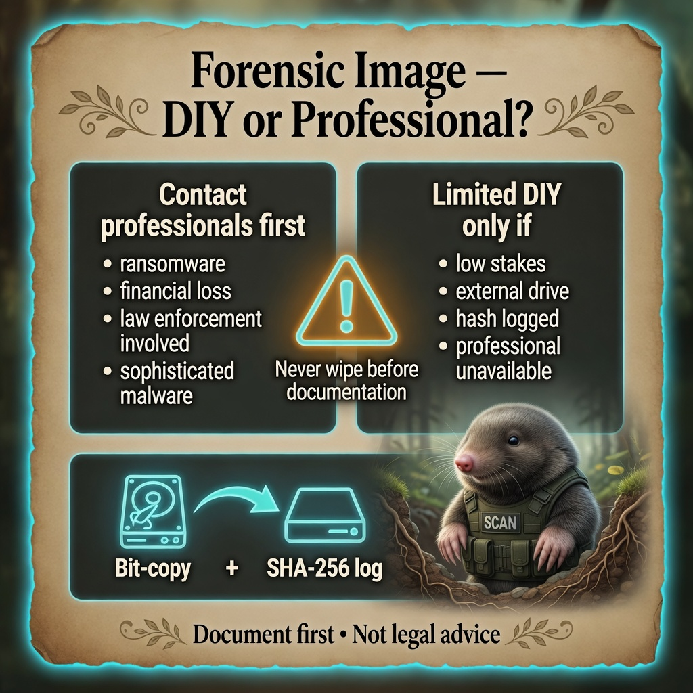

# How to Create a Forensic Image

**Personal Security Investigation Framework**  
Version 1.0 | Cross-Platform

This companion to [When & How to Escalate](When-and-How_to-Escalate.md) explains **when** a forensic image matters, **when to let professionals do it**, and **safe high-level options** if a pro explicitly guides you or stakes are lower. It is not legal advice and does not produce court-certified chain of custody.

---

## What a forensic image is

A **forensic image** is a bit-for-bit copy of a storage device (hard drive, SSD, phone) made in a way that preserves evidence and records integrity (often with cryptographic hashes). Professionals use images so analysis does not alter the original device.

**Why it matters:** Scare-tactic campaigns often push victims to wipe or reinstall immediately — that destroys evidence. An image (or professional imaging) preserves what was on the disk **before** changes.

<p align="center">
  
</p>

*Infograph — [full gallery](../Infographs/README.md)*

---

## When you should **not** DIY

Stop and use **incident response / digital forensics** (see [Choosing the Right Professional Help](Choosing-the-Right-Professional-Help.md)) if **any** of these are true:

- Financial loss, ransomware, or confirmed data theft
- Sophisticated persistence (survives reboot / reinstall)
- You may involve law enforcement and want admissible handling
- You are not comfortable with technical steps or hash verification
- The device is still actively compromised and in use for banking or work

**Default recommendation for high-stakes cases:** Power down after minimal documentation (photos of screen, note times), contact IR or LE, and **do not** image the drive yourself unless they instruct you.

---

## When limited DIY may be acceptable

Only consider a **self-made backup image** when:

- Professionals are unavailable for days and you need a **personal archive** (not court evidence)
- Stakes are lower (no financial impact, scare-tactic files only, clean scans otherwise)
- You will **stop using** the original device for sensitive tasks until reviewed
- You understand this is **educational self-help**, not certified forensics

Even then: complete your [investigation log](shared-templates/templates/investigation_log_template.md) and [file inventory](shared-templates/templates/suspicious_files_inventory_template.md) **first**.

---

## Before imaging — checklist

- [ ] Investigation log and inventory up to date
- [ ] Screenshots of suspicious file properties already saved
- [ ] You have an **external drive** at least as large as the data being imaged (empty or dedicated)
- [ ] You know imaging will take **hours** on large drives
- [ ] You will **not** boot the suspect OS to “use it normally” during imaging if avoidable
- [ ] You recorded **date, time, tool name, and version** in your log

---

## High-level approaches (by platform)

### Windows

**Professional standard:** FTK Imager, dd, or vendor tools on a **write-blocked** or booted-from-USB forensic environment.

**Educational / lower-stakes pattern (conceptual only):**

1. Boot from a **live USB** (e.g., Linux live environment) so the internal drive is not actively written by Windows.
2. Attach external target drive.
3. Use a block-copy tool that outputs a single image file (e.g., `dd`, `dc3dd`, or GUI imager from the live environment).
4. Compute **SHA-256** hashes of the image file; log them in your investigation log.
5. Store the external drive disconnected and labeled.

**Do not** run imaging software inside a potentially compromised Windows session if you can avoid it — malware can interfere with reads.

### macOS

**Professional standard:** Apple-approved forensic workflows or IR firm tooling; Apple Silicon and T2/Secure Enclave add complexity.

**Educational pattern:**

1. Stop using the Mac for sensitive work.
2. Prefer **professional imaging** for FileVault-encrypted systems — decryption and handling are error-prone.
3. If a pro guides you: full-disk image to external APFS/HFS+ compatible volume with hash verification logged.

### Linux

**Educational pattern (common home user):**

```bash
# Example pattern only — replace devices; VERIFY names with lsblk first
# source=/dev/sdX  target=/dev/sdY  image=~/case_2026-06-27.img

sudo dd if=/dev/sdX of=/path/to/external/case_2026-06-27.img bs=64M conv=sync,noerror status=progress
sha256sum /path/to/external/case_2026-06-27.img | tee -a investigation_log.txt
```

**Critical:** Wrong `if=` device destroys wrong disk. Double-check with `lsblk`. Prefer `dd` only when you understand device names.

---

## Hash verification (why it matters)

After creating an image, record:

| Field | Example |
|-------|---------|
| Image filename | `case_2026-06-27_laptop.img` |
| SHA-256 | `abc123...` |
| Tool + version | `dc3dd 7.4.5` |
| Source device ID | Serial or model from label |
| Date/time (UTC + local) | 2026-06-27 14:30 local |

Hash mismatch later means the file changed — note it immediately in your log.

---

## What to give professionals instead of DIY

Often you do **not** need a full disk image on day one. Hand off:

- Investigation log + inventory (from templates)
- Screenshots and scan exports
- Network captures (`.pcapng`)
- Autoruns / KnockKnock exports

Ask: *“Do you need a full forensic image, or is my documentation package enough to start?”*

See [How to Prepare a Professional Summary](How-to-Prepare-a-Professional-Summary.md).

---

## Common mistakes

| Mistake | Why it hurts |
|---------|--------------|
| Reinstalling Windows/macOS before imaging | Overwrites evidence |
| Running unknown “forensic” EXEs from the scare campaign | May be malware |
| Imaging while logged into a compromised account | Active malware alters reads |
| Skipping hash logs | Cannot prove integrity later |
| Assuming DIY image is court-ready | Chain of custody requires pro process |

---

## Related guides

- [When & How to Escalate](When-and-How_to-Escalate.md)
- [Choosing the Right Professional Help](Choosing-the-Right-Professional-Help.md)
- [What to Expect When Working with Law Enforcement](What-to-Expect-When-Working-with-Law-Enforcement.md)
- [Project Structure Recommendation](shared-templates/templates/project_structure_recommendation.md)

---

**End of How to Create a Forensic Image**

Educational self-help only. When stakes are high, let professionals image the drive.