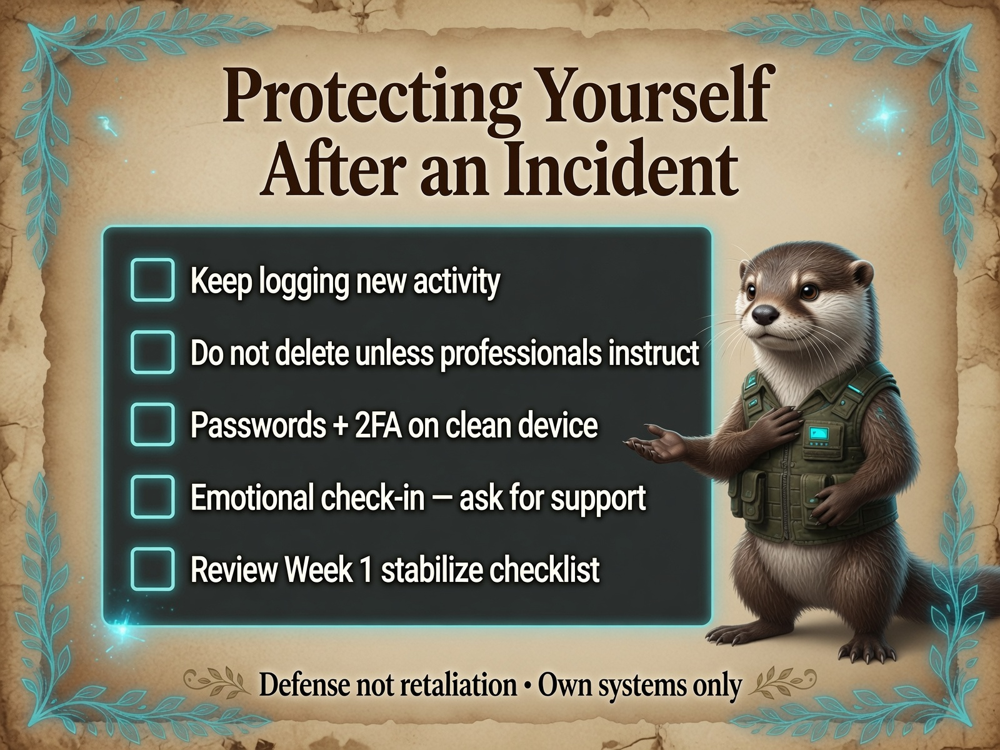
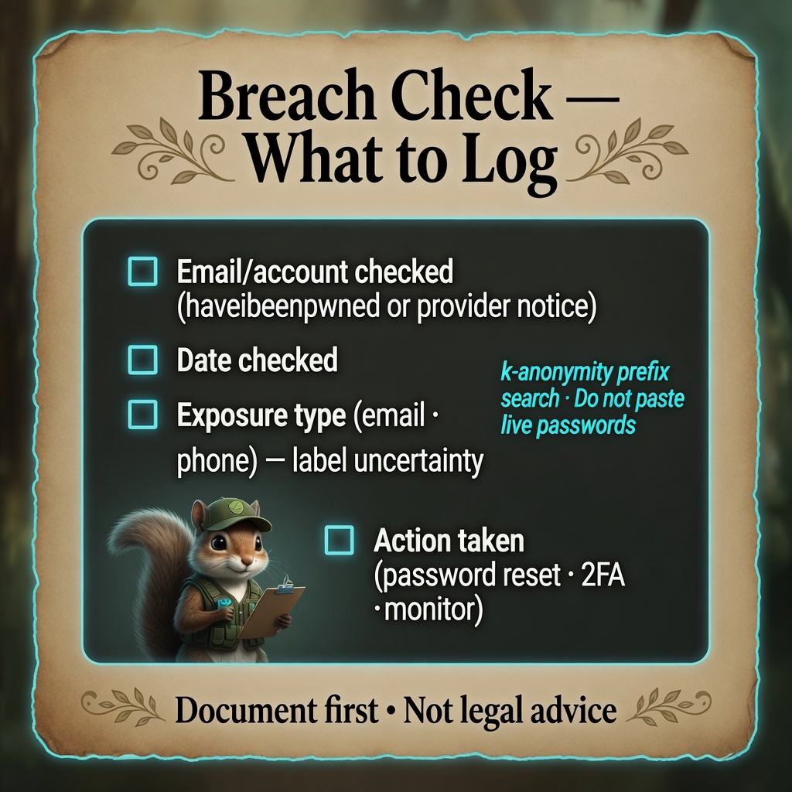

# Protecting Yourself After an Incident

**Personal Security Investigation Framework**  
Version 1.0 | Cross-Platform

This guide covers **longer-term defensive steps** after scare-tactic files, suspected compromise, or harassment — whether you escalated to professionals or closed a low-risk investigation. Pair with [When & How to Escalate](When-and-How_to-Escalate.md) and your platform’s safety tools.

**Scope:** Defensive actions on **your** accounts, devices, and network. Not retaliation or offensive action.

<p align="center">
  
</p>

*Infograph — [full gallery](../Infographs/README.md)*

---

## Mindset first

Harassment and scare tactics often aim to keep you **reacting**. A steady rhythm beats a one-time panic fix.

| Principle | Practice |
|-----------|----------|
| Document before change | Log what you alter and when |
| Layer defenses | No single tool fixes everything |
| Sustainable pace | Weekly habits beat exhausting sprints |
| Escalate when red flags return | Use the [flowchart](When-and-How_to-Escalate.md#decision-flowchart) |

---

## Week 1 — Stabilize (priority order)

### 1. Accounts that matter most

- [ ] **Email** — strong unique password, 2FA (app-based preferred over SMS where possible)
- [ ] **Banking & payment** — unique passwords, 2FA, review recent transactions
- [ ] **Password manager** — if not already in use (~90% industry recommendation reliability)
- [ ] **Recovery codes** — save 2FA backup codes offline (paper or encrypted vault)

### 2. Devices

- [ ] OS and browser **fully updated**
- [ ] Remove unknown **startup / login items** only **after** logging in inventory ([framework phases](../minimal-tools/windows/My_Security_Framework_Windows-OS_v1.1_Minimal_Tools.md))
- [ ] Run a **second-opinion scan** (Defender offline, Malwarebytes, or platform equivalent)
- [ ] Consider a **dedicated browser profile** for banking vs general browsing

### 3. Network

- [ ] Router **firmware** updated; change Wi-Fi password if compromise was suspected
- [ ] Review **connected devices** list on router admin page
- [ ] Guest network for IoT devices if your router supports it (~80% home hygiene best practice)

### 4. Platform safety (social / X)

See **[Platform Safety (X & Social)](../defense/Platform-Safety-X-and-Social.md)** for the full evidence-first workflow. Quick list:

- [ ] **Block** and **mute** harassing accounts — do not engage in public fights
- [ ] Restrict **who can message or mention** you (platform settings)
- [ ] **Document** threatening posts (screenshots with timestamps, URLs)
- [ ] **Report** via platform tools when policies are violated
- [ ] Consider **limited posting** until situation stabilizes

---

## Week 2–4 — Harden

### Identity & credentials

<p align="center">
  
</p>

*Infograph — [full gallery](../Infographs/README.md) · [Web hub breach check](../web/index.html#breach-check)*

| Action | Notes |
|--------|-------|
| Rotate passwords for breached or reused sites | Check [Have I Been Pwned](https://haveibeenpwned.com) (~85% useful; not exhaustive) |
| Unique email aliases for new signups | Reduces cross-site correlation |
| Review app OAuth connections | Revoke unknown third-party access (Google, Microsoft, Apple account panels) |

### Device hygiene

- Enable **full-disk encryption** (BitLocker, FileVault, LUKS) if not already on
- Automatic **backups** to separate media or encrypted cloud — test restore once
- Disable **remote access** features you do not use (RDP, SSH, screen sharing)

### Investigation habits (light ongoing)

- Weekly 5-minute check: new suspicious files? unexpected login emails?
- Monthly: rerun light persistence check (Autoruns / LaunchAgents / `systemctl` review)
- Keep `investigation_log` append-only if concerns continue

---

## Ongoing monitoring cadence

| Frequency | Action |
|-----------|--------|
| **Weekly** | Quick file/account check; note in log if clean |
| **Monthly** | OS + app updates; router device list; password manager audit |
| **Quarterly** | Review 2FA coverage; backup test; framework refresh read |

If **new** scare-tactic files or targeting appears → new dated investigation folder; do not overwrite old evidence.

---

## Red flags that mean “stop DIY — escalate again”

- New financial unauthorized activity
- Persistence returns after cleanup
- Ransom notes or locked files
- Credible threats of physical harm
- LE or IR told you to preserve devices — follow their instructions

→ [When & How to Escalate](When-and-How_to-Escalate.md) | [Choosing Professional Help](Choosing-the-Right-Professional-Help.md)

---

## Emotional safety

Targeted digital harassment is draining. Practical steps:

- Limit doom-scrolling and harasser timelines
- Tell one trusted person what is happening
- Use professional support if anxiety or sleep is severely affected
- Remember: documenting calmly is **already** a strong defensive act

---

## What not to do

| Avoid | Why |
|-------|-----|
| Hacking back or doxxing harassers | Illegal and escalates harm |
| Factory reset without documentation | Destroys evidence |
| Paying unknown “recovery” services cold-calling you | Common secondary scam (~75% fraud-advisory pattern) |
| Sharing full evidence publicly | Can harm LE cases and your privacy |

---

## Checklist summary (printable)

```
WEEK 1
[ ] Email + banking secured (2FA)
[ ] OS/browser updated
[ ] Scans complete; inventory updated
[ ] Router reviewed; Wi-Fi password rotated if needed
[ ] Platform block/report/document done

ONGOING
[ ] Weekly light check logged
[ ] Monthly updates + device list review
[ ] Escalate if red flags return
```

---

## Related guides

- [When & How to Escalate](When-and-How_to-Escalate.md)
- [How to Prepare a Professional Summary](How-to-Prepare-a-Professional-Summary.md)
- [What to Expect When Working with Law Enforcement](What-to-Expect-When-Working-with-Law-Enforcement.md)
- [Quick Start Guide](Quick-Start-Guide.md)

---

**End of Protecting Yourself After an Incident**

Defense is ongoing. You do not have to implement everything in one day — start with accounts and updates, then layer the rest.