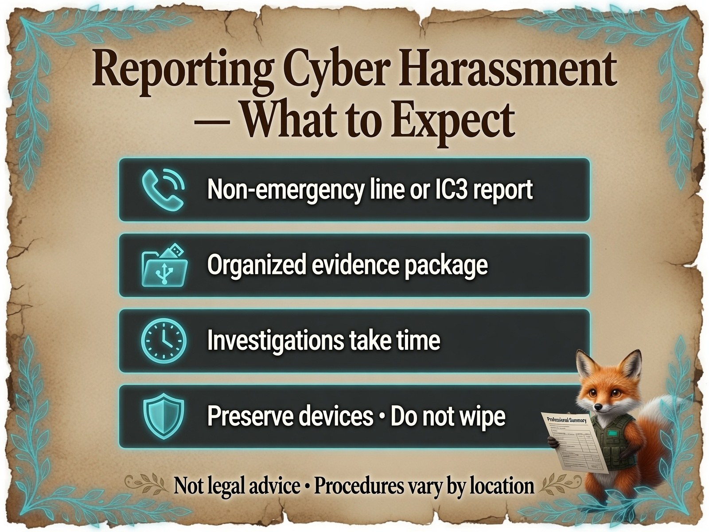

# What to Expect When Working with Law Enforcement

**Personal Security Investigation Framework**  
Version 1.0 | Cross-Platform (U.S.-oriented examples)

This companion to [When & How to Escalate](When-and-How_to-Escalate.md) describes **typical** experiences when reporting cyber harassment, fraud, or targeted scare tactics to law enforcement. Procedures vary by country, state, and agency. **This is not legal advice** — consult a qualified attorney when criminal or civil strategy matters.

**Emergency:** If you are in immediate physical danger, call your local emergency number first.

  

*Infograph — [full gallery](../Infographs/README.md)*

---

## When law enforcement is a good fit

Consider reporting when you have **documented** evidence of:

- Stalking or credible threats (online or offline)
- Fraud, unauthorized financial transactions, or identity theft
- Harassment campaigns with repeated, targeted digital behavior
- Malware or intrusions you believe are **criminal** (not mere pranks)

Scare-tactic files alone may or may not meet local thresholds — your documentation still helps professionals and LE assess the situation.

---

## Before you call or visit

1. Complete [How to Prepare a Professional Summary](How-to-Prepare-a-Professional-Summary.md).
2. Organize files per [Project Structure Recommendation](shared-templates/templates/project_structure_recommendation.md).
3. Write a **one-page timeline** (dates, what happened, what you observed — facts, not theories).
4. Decide what devices you can **leave untouched** until advised otherwise.
5. Consider whether you want a **support person** present (friend, family, advocate).

---

## How to make first contact

| Channel | When to use |
|---------|-------------|
| **Local police non-emergency line** | Stalking, harassment, local jurisdiction |
| **Police cyber / fraud unit** (if your area has one) | Digital evidence, online targeting |
| **[FBI IC3](https://www.ic3.gov)** (U.S.) | Internet crime, fraud, significant cyber incidents — online report + reference number |
| **FTC** ([reportfraud.ftc.gov](https://reportfraud.ftc.gov)) | Identity theft, consumer fraud — complements criminal report |

You can file **IC3 and local police** — they serve different roles. IC3 does not replace local investigation for all case types.

---

## What usually happens at intake

**Typical steps** (varies widely, ~70–80% pattern from public LE cyber guidance):

1. **Intake interview** — You describe what happened in chronological order.
2. **Evidence request** — Logs, screenshots, emails, messages, financial records, device access (sometimes).
3. **Report number** — You receive a case or incident number **if** a report is taken.
4. **Follow-up uncertainty** — Not every report leads to immediate investigation; seriousness and resources matter.

**Stay factual:** What you saw, when, on which device, with what files or messages. Avoid diagnosing attacker identity unless you have strong evidence.

---

## What they may ask you to do

- **Preserve devices** — Stop using affected hardware for sensitive activity; do not wipe.
- **Provide exports** — Investigation log, inventory, `.pcapng`, message screenshots (with timestamps visible).
- **Forensic imaging** — They or a contracted examiner may image drives ([forensic image guide](How-to-Create-a-Forensic-Image.md)).
- **Limit public discussion** — Ongoing cases sometimes benefit from less social media detail (agency-dependent).
- **Additional interviews** — Follow-up questions are normal.

**Do not delete** messages, files, or accounts unless LE or your attorney advises otherwise.

---

## What they may **not** do (set expectations)

| Expectation | Reality |
|-------------|---------|
| Instant arrest | Investigations take time; thresholds vary |
| 24/7 personal IT support | LE is not your help desk |
| Cross-border pursuit in every case | Jurisdiction limits apply |
| Recover money immediately | Financial recovery often involves banks and separate processes |

Lack of immediate action does **not** mean your report was worthless — it creates a record and may connect to other complaints.

---

## Working effectively with officers

**Helpful behaviors:**

- Bring printed summary + USB with organized evidence folder
- Use plain language; offer glossary for technical terms if needed
- Note case/incident numbers in your investigation log
- Ask: *“What should I preserve or avoid doing on my devices?”*

**Avoid:**

- Speculating about motives or naming suspects without evidence
- Handing over devices without understanding return process (ask first)
- Volunteering unrelated personal data

---

## Privacy and your data

- Redact unrelated third-party PII in screenshots when possible.
- Ask how your evidence will be stored and who can access it (agency policies vary).
- If you are also consulting **incident response** or a **lawyer**, tell LE so efforts stay coordinated.

---

## If you feel dismissed

1. Politely ask if a **cybercrime or fraud unit** exists at another desk or regional office.
2. File **IC3** (U.S.) for federal awareness and reference.
3. Consult an attorney about civil options or victim advocate services in your area.
4. Continue **personal documentation** and [protective hardening](Protecting-Yourself-After-an-Incident.md).

---

## After the report

- Log every contact (date, agency, name/badge if given, reference number) in your investigation log.
- Continue light monitoring; new activity → document and report as an update.
- Read [Protecting Yourself After an Incident](Protecting-Yourself-After-an-Incident.md).
- Take care of mental health — targeted harassment is stressful; support networks help.

---

## Related guides

- [Choosing the Right Professional Help](Choosing-the-Right-Professional-Help.md)
- [How to Prepare a Professional Summary](How-to-Prepare-a-Professional-Summary.md)
- [When & How to Escalate](When-and-How_to-Escalate.md)

---

**End of What to Expect When Working with Law Enforcement**

Procedures differ by location. This guide sets calm expectations — not legal guarantees.