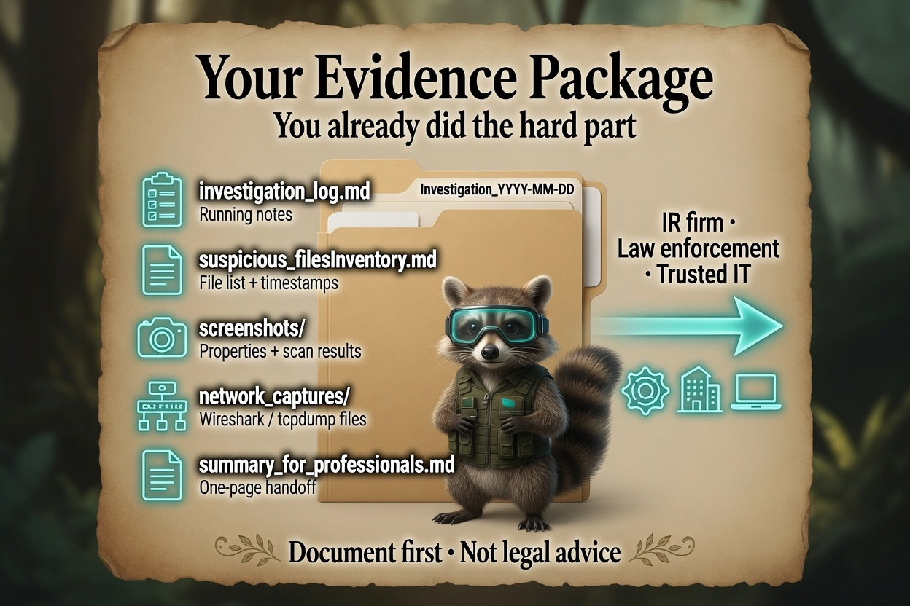
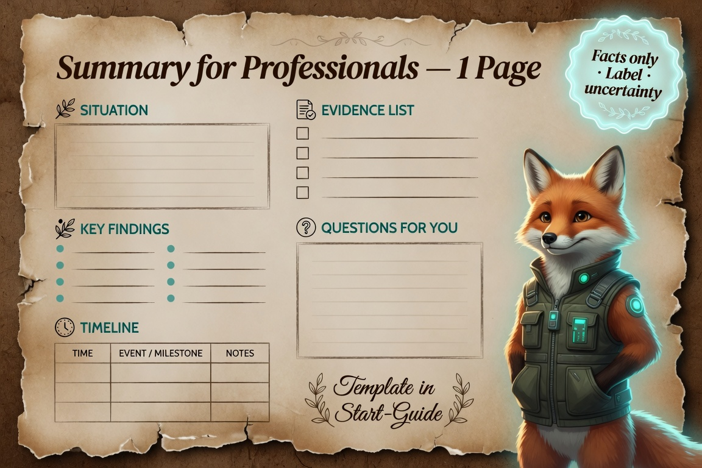
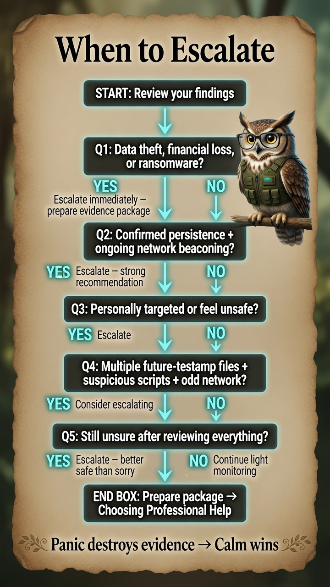
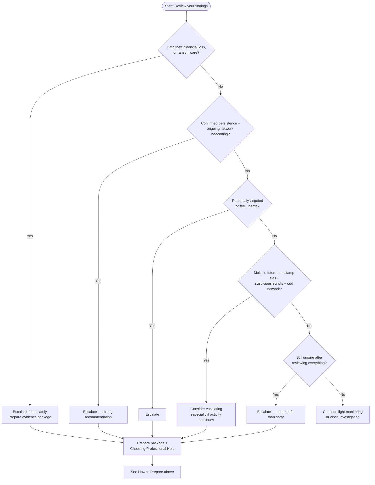

# When & How to Escalate

**Personal Security Investigation Framework**  
Version 1.2 | Cross-Platform

This guide helps you decide **when** it is time to stop DIY investigation and get professional help, and **how** to do it effectively while preserving the value of everything you have already documented.

Escalating is **not** a failure — it is a responsible and often the smartest decision.

---

## When to Escalate (Decision Criteria)

Consider escalating if **any** of the following are true:

### High-Confidence Red Flags
- You have confirmed malicious files or scripts that are actively stealing data, installing persistence, or communicating with external servers.
- There is clear evidence of financial impact (unauthorized transactions, crypto wallet access, ransomware, etc.).
- You have discovered sophisticated persistence mechanisms (especially ones that survive reboots or reinstalls).
- Multiple indicators point to **targeted** activity against you personally (files named after you, specific personal information used, repeated attempts over time).

### Medium-Confidence Situations (Escalate if Unsure)
- You have multiple future-timestamped files + suspicious scripts + network beaconing, even if individual pieces are not 100% confirmed malicious.
- The activity continues or increases after basic cleanup attempts.
- You feel unsafe, harassed, or that someone is specifically targeting you (doxxing, stalking via digital means, etc.).
- You are not comfortable continuing the investigation or interpreting the findings.

### When in Doubt
If you are unsure whether something is serious, **err on the side of escalating**. Professionals would rather receive a well-documented early report than a late one after more damage has occurred.

**Rule of thumb:** If this were happening to a friend or family member, would you tell them to handle it alone or get help?

---

## How to Prepare Before Escalating

Do these steps **before** contacting professionals. They dramatically increase the usefulness of your evidence.

### 1. Complete Your Core Evidence Package
Make sure you have:
- Up-to-date `investigation_log_YYYY-MM-DD.md`
- Up-to-date `suspicious_files_inventory_YYYY-MM-DD.md`
- All screenshots of file properties, scan results, and tool outputs
- Network capture files (`.pcapng` or `.pcap`) from Wireshark/tcpdump
- Any exported reports from Autoruns, KnockKnock, Process Explorer, etc.

<p align="center">
  
</p>

*Infograph — [full gallery](../Infographs/README.md)*

### 2. Create a Clean Summary Document (Recommended)
Create a short 1–2 page summary with these sections:

**Summary for Professionals**

- **Date of this summary:** [YYYY-MM-DD]
- **Your situation in one paragraph:** [Brief, factual description]
- **Key findings:** [Bullet list of the most important discoveries]
- **Timeline of events:** [Short chronological list]
- **Evidence package contents:** [List what you are providing]
- **What you have already done:** [e.g., ran scans, documented timestamps, stopped using the machine for sensitive work]
- **Questions you have for professionals:** [Optional]

This summary helps busy professionals quickly understand the situation.

<p align="center">
  
</p>

*Infograph — [full gallery](../Infographs/README.md) · [How to prepare a summary](How-to-Prepare-a-Professional-Summary.md)*

### 3. Decide Who to Contact

See **[Choosing the Right Professional Help](Choosing-the-Right-Professional-Help.md)** for a full comparison (incident response vs. law enforcement vs. consultant vs. financial institutions).

Quick list (in rough order of severity):

- **Your bank / financial institutions** — if money or accounts are involved (often do this immediately).
- **Professional incident response / digital forensics company** — financial loss, ransomware, sophisticated malware.
- **Local law enforcement** (non-emergency line or cybercrime unit) — stalking, harassment, targeted activity.
- **FBI Internet Crime Complaint Center (IC3)** or equivalent in your country.
- **Trusted IT professional or cybersecurity consultant** you already know — triage and second opinion.

---

## Decision Flowchart

Use this section when you have finished your initial documentation and want a clear yes/no path to escalation.

### Infographic (image)

<p align="center">
  
</p>

*Text-accurate version: [Infograph_When-to-Escalate.svg](../Infograph_When-to-Escalate.svg) (screen readers and printing). [Full gallery](../Infographs/README.md).*

### Visual flowchart (Mermaid)

GitHub and many markdown viewers render this diagram automatically:



### Text version (copy-friendly)

```
Start
│
├── Are there clear signs of data theft, financial loss, or ransomware?
│   ├── Yes → Escalate immediately (prepare evidence package)
│   └── No → Continue
│
├── Do you have confirmed persistence mechanisms + ongoing network beaconing?
│   ├── Yes → Escalate (strong recommendation)
│   └── No → Continue
│
├── Are you feeling personally targeted or unsafe?
│   ├── Yes → Escalate
│   └── No → Continue
│
├── Have you found multiple future-timestamp files + suspicious scripts + odd network activity?
│   ├── Yes → Consider escalating (especially if activity continues)
│   └── No → Continue light monitoring
│
└── Still unsure after reviewing everything?
    ├── Yes → Escalate (better safe than sorry)
    └── No → Continue monitoring or close investigation
```

Organize your files using the [Project Structure Recommendation](shared-templates/templates/project_structure_recommendation.md) before handing off evidence.

---

## What to Expect When Escalating

- Professionals will likely want your evidence package (log + inventory + captures).
- They may ask you to stop using the affected device or create a forensic image.
- Law enforcement may open a case and guide you on next steps.
- You may be asked not to discuss details publicly while the investigation is active.

Having clean, well-organized documentation (thanks to the templates) makes their job much easier and increases the chance of useful action.

---

## After You Escalate

- Continue documenting any new activity in your investigation log.
- Do not delete anything unless instructed by professionals.
- Take care of your mental and emotional well-being — being targeted can be stressful.
- Consider improving your overall security posture (unique passwords, 2FA, updates, etc.) while the professionals work.

---

## In-Depth Companion Guides

| Guide | Status |
|-------|--------|
| [Choosing the Right Professional Help](Choosing-the-Right-Professional-Help.md) | Available |
| [Project Structure Recommendation](shared-templates/templates/project_structure_recommendation.md) | Available |
| [How to Create a Forensic Image](How-to-Create-a-Forensic-Image.md) | Available |
| [What to Expect When Working with Law Enforcement](What-to-Expect-When-Working-with-Law-Enforcement.md) | Available |
| [How to Prepare a Professional Summary](How-to-Prepare-a-Professional-Summary.md) | Available |
| [Protecting Yourself After an Incident](Protecting-Yourself-After-an-Incident.md) | Available |

---

## Final Reminder

Escalating does **not** mean you did something wrong.  
It means you recognized the limits of DIY investigation and took responsible action to protect yourself and potentially others.

Your well-organized evidence package (built using the templates and frameworks) is one of the most valuable things you can provide to professionals.

You are doing the right thing by documenting carefully and knowing when to ask for help.

---

**End of When & How to Escalate**

This guide is part of the open-source Personal Security Investigation Framework project. It is intended to be referenced from all Minimal Tools and Full Deep Dive framework versions, as well as the Quick Start Guide. 

Stay calm. Document everything. Know when to escalate. You are not alone.