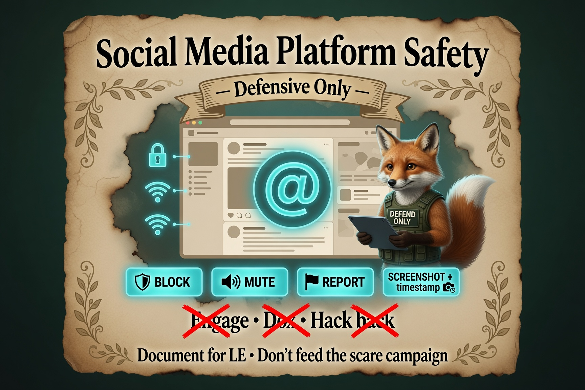

# Platform Safety — X and Social

**Personal Security Investigation Framework**  
Version 1.0  
**Phase:** Defense layer — platform actions on **your** accounts

Harassment and scare tactics often span **devices and social platforms**. This guide covers **defensive** actions on X (formerly Twitter) and similar sites: block, mute, report, document — not counter-harassment.

**Pair with:** Endpoint investigation ([Minimal Tools](../minimal-tools/windows/My_Security_Framework_Windows-OS_v1.1_Minimal_Tools.md)) and [Block and Harden](Block-and-Harden.md).

**Scope IN:** Block, mute, restrict mentions, download your data, screenshots for evidence, report ToS violations.  
**Scope OUT:** Doxxing harassers, sockpuppet retaliation, hacking accounts, brigading back (~95% ethics).

**Not legal advice.** For criminal harassment or credible threats, see [When & How to Escalate](../Start-Guide/When-and-How_to-Escalate.md) and [Working with Law Enforcement](../Start-Guide/What-to-Expect-When-Working-with-Law-Enforcement.md).

<p align="center">
  
</p>

*Infograph — [full gallery](../Infographs/README.md)*

---

## Document before platform changes

Platform moderation may **remove** reported content. Capture evidence first (~85% — SWGDE online content acquisition practices; X Help Center ~85%).

| Step | Action |
|------|--------|
| 1 | Screenshot posts — include URL bar, username, timestamp, full thread context |
| 2 | Save to `screenshots/` with dated filename |
| 3 | Note in `investigation_log` — date, URL, summary (facts, not rage) |
| 4 | Optional: [Download your X archive](https://help.x.com/en/managing-your-account/how-to-download-your-x-archive) for timeline correlation (~85%) |

**Comprehension gate:** “Do I have screenshots and log entries for the worst posts? Ready to block/mute/report?”

---

## X — defensive toolkit (~85% X Help Center)

Official references change; verify at [help.x.com](https://help.x.com/) before teaching others.

### Block

- Stops direct interaction: DMs (per settings), replies, reposts, tags in many cases (~85%)
- **Blocked user may be notified** you blocked them (~85%)
- **Public accounts (~85–90%):** Policy updates mean blocked users may still **view** public posts when visiting your profile directly — they often cannot engage. Do not assume block = invisibility; adjust posting if needed

### Mute

- Hides their posts from **your** timeline; they are **not** notified (~85%)
- Prefer mute when you want less noise **without** signaling a block (~75% inference — de-escalation)

### Restrict mentions / DMs

- Settings → Privacy and safety → restrict who can DM or mention you (~85%)
- Reduces drive-by harassment surface

### Report

- Use in-app report flow for abuse, harassment, impersonation (~85%)
- [Report abusive behavior](https://help.x.com/en/safety-and-security/report-abusive-behavior) — keep confirmation screenshots if shown

### Download your data

- Archive request via X settings — useful to correlate online posts with local file drops (~85%)
- Store export encrypted locally; not in public repo

---

## Recommended order (evidence-first)

```
Screenshot + log → Mute (if you want quiet) → Report (if ToS violated) → Block (if engagement must stop)
```

Adjust if LE or counsel advises preserving visible public threads for an open case.

---

## Correlate social and endpoint events

| Signal | Log field |
|--------|-----------|
| Post time of “you’re hacked” claim | Timeline entry |
| Local scare file discovery time | Inventory timestamp |
| Matching usernames in filename | Inventory + screenshot |

Correlation supports [professional summary](../Start-Guide/How-to-Prepare-a-Professional-Summary.md) and IC3 reports (~80%) — facts only.

---

## What not to do on X

| Avoid | Why |
|-------|-----|
| Public arguments with harassers | Amplifies reach (~80%) |
| Quote-tweeting threats for “awareness” | Spreads harassment (~75%) |
| Sharing private info about harassers | Doxxing — illegal and harmful (~95%) |
| Clicking links in threat DMs | Phishing risk (~90%) |
| “Hack back” or access their accounts | Out of scope (~100%) |

---

## Other platforms (short)

Same pattern applies elsewhere:

- **Screenshot → log → block/restrict → report**
- Check platform safety center for block/report/export
- Do not engage in comment wars during active investigation

---

## Account hardening on X (Week 1)

- [ ] Strong unique password (~90%)
- [ ] **App-based 2FA** — not SMS-only if avoidable (~80%)
- [ ] Review **connected apps** / OAuth in security settings
- [ ] Restrict mentions/DMs if harassment is active (~85%)
- [ ] Consider **private account** temporarily as circuit breaker (~75% — tradeoff: less public reach)

Password changes on a **clean device**, not a suspect PC (~85%).

---

## Escalation triggers (platform + device)

Escalate when **any** apply:

- Credible threats of physical harm → emergency services if immediate; else LE (~90%)
- Doxxing (address, workplace published) → LE / IC3 with screenshots (~85%)
- Harassment plus **local** timestomped files + beaconing → medium-confidence pro path ([escalate guide](../Start-Guide/When-and-How_to-Escalate.md))
- Financial fraud linked to social engineering → bank + IC3 (~90%)

**IC3 (~95%):** https://www.ic3.gov — federal cyber crime intake; retain evidence per site FAQ.

**Local LE:** Report in the jurisdiction where **you** experienced harm — use non-emergency lines for documented cyber harassment; **not legal advice**.

---

## Checklist (printable)

```
EVIDENCE
[ ] Screenshots with URL + timestamp
[ ] investigation_log entry
[ ] Optional: X data archive requested

DEFENSE
[ ] Mute and/or block harassing accounts
[ ] Report clear ToS violations
[ ] Restrict mentions/DMs if needed
[ ] 2FA enabled on X

BOUNDARIES
[ ] No public engagement / hack back
[ ] Escalate if physical/financial red flags
```

---

## Related guides

- [Block and Harden](Block-and-Harden.md)
- [Safe Removal After Documentation](Safe-Removal-After-Documentation.md)
- [Protecting Yourself After an Incident](../Start-Guide/Protecting-Yourself-After-an-Incident.md)
- [How to Prepare a Professional Summary](../Start-Guide/How-to-Prepare-a-Professional-Summary.md)

---

**End of Platform Safety — X and Social**

Silence the noise, preserve the record, escalate when thresholds are met.