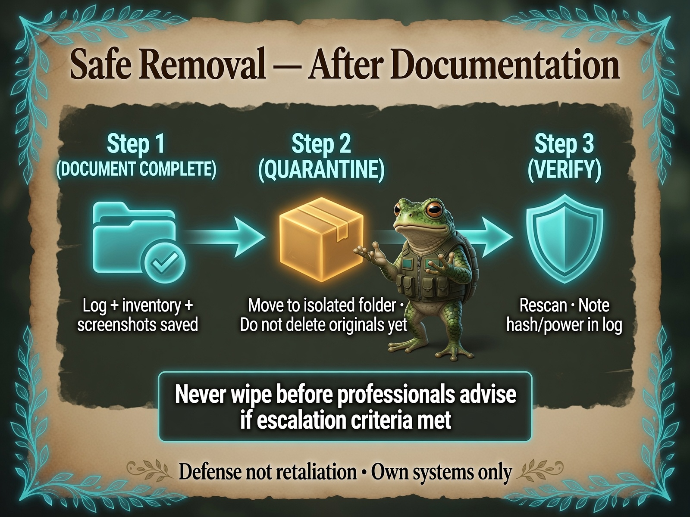

# Safe Removal After Documentation

**Personal Security Investigation Framework**  
Version 1.0 | Cross-Platform  
**Phase:** Remove / quarantine — **only after** Phase 0–2 documentation

This guide covers **neutralizing** suspicious files and light persistence on **your** systems without destroying evidence professionals need. It is not a substitute for incident response.

**Hard rule:** No deletion, secure shred, or full OS reinstall as DIY defaults (~95% — NIST/SWGDE-aligned evidence preservation).

---

## Before you start

You may proceed with **DIY quarantine** only if **all** are true:

- [ ] Screenshots of file properties / metadata saved
- [ ] Entry in `suspicious_files_inventory_YYYY-MM-DD.md`
- [ ] Investigation log notes what you are about to do
- [ ] No confirmed financial theft, ransomware, or reboot-surviving persistence you cannot explain
- [ ] You are comfortable with findings **or** have escalated and been told to quarantine locally

If any **escalation red flag** applies → stop. See [When & How to Escalate](../Start-Guide/When-and-How_to-Escalate.md).

<p align="center">
  
</p>

*Infograph — [full gallery](../Infographs/README.md)*

---

## Decision tree

```
Documented in inventory + screenshots?
├─ NO → Stop. Complete Phase 0–2.
└─ YES
    ├─ Passive scare file only (.txt, .jpg, no scripts)? → Move to quarantine folder (below)
    ├─ Executable / script / unknown binary? → Quarantine move; consider escalation
    ├─ Startup item / service you did not install? → Disable + log; escalate if returns after reboot
    └─ Kernel / ransomware / unsure? → STOP DIY → Pro/IR
```

**Never in DIY path:** `rm -rf`, `format`, `diskpart clean`, `sdelete`, Gutmann shred, factory reset (~98% — destroys MFT/USN journal artifacts).

---

## Quarantine principles (~90%)

1. **Move**, do not delete — preserves binary for analysis
2. Use a **dated folder** outside cloud sync (e.g. `Documents/Quarantine_2026-06-27/`)
3. Optional: **password-protected ZIP** for handoff to pros — keep original documented until ZIP verified
4. **Disable** startup items only after logging name/path in inventory
5. If move fails with “file in use” → **escalation trigger** (active process / persistence)

---

## Windows

### Disable startup item (after logging)

1. Task Manager → Startup — note app name, path, screenshot
2. Disable — do not delete registry keys until exported or pros advise (~85%)

**Autoruns (Full Deep Dive):** Export suspicious entries before unchecking.

### Quarantine move (PowerShell)

```powershell
# Alex security note:
# Scope: One file you name. MOVE only — not delete.
# Prerequisite: Screenshot + inventory entry exist.
# Failure: "File in use" = escalate; do not force with admin tools.

$date = Get-Date -Format "yyyy-MM-dd"
$q = "$env:USERPROFILE\Documents\Quarantine_$date"
New-Item -ItemType Directory -Path $q -Force
Move-Item -LiteralPath "C:\path\to\suspicious_file.txt" -Destination $q
```

Log the new path in your inventory.

### Metadata export (read-only)

```powershell
# Alex security note: Read-only. Writes one CSV in Documents.
Get-ChildItem -Path "C:\path\to\folder" -Recurse |
  Select-Object FullName, Length, CreationTime, LastWriteTime, LastAccessTime |
  Export-Csv -Path "$env:USERPROFILE\Documents\evidence_timeline.csv" -NoTypeInformation
```

---

## macOS

### Login items / LaunchAgents

1. System Settings → General → Login Items — screenshot unknown items
2. Uncheck or remove only after inventory entry (~85%)
3. `/Library/LaunchAgents` and `~/Library/LaunchAgents` — **log paths**; prefer KnockKnock (Full Deep Dive) before changes

### Quarantine move

```bash
# Alex security note: MOVE only. Prerequisite: documentation complete.
mkdir -p ~/Documents/Quarantine_2026-06-27
mv -n "/path/to/suspicious_file" ~/Documents/Quarantine_2026-06-27/
```

### Metadata (read-only)

```bash
# Alex security note: Read-only.
stat -x "/path/to/suspicious_file" | tee ~/Desktop/evidence_timeline.txt
```

### Optional encrypted container

Disk Utility → New Image → encrypted DMG for quarantined files (~85%). Log passphrase storage separately — not in investigation log plaintext.

---

## Linux

### systemd / cron

```bash
# Alex security note: Read-only listing first.
systemctl --user list-unit-files --state=enabled
crontab -l
```

Disable only after logging: `systemctl --user disable unit-name` (~80%).

### Quarantine move

```bash
mkdir -p ~/Documents/Quarantine_2026-06-27
mv -n "/path/to/suspicious_file" ~/Documents/Quarantine_2026-06-27/
chmod 000 ~/Documents/Quarantine_2026-06-27/suspicious_file   # optional: strip execute
```

### Metadata (read-only)

```bash
stat "/path/to/suspicious_file" | tee ~/Desktop/evidence_timeline.txt
ls -l --time=ctime "/path/to/suspicious_file" >> ~/Desktop/evidence_timeline.txt
```

---

## Evidence packages for handoff (~90–95%)

After quarantine, pros may want:

| Format | Use |
|--------|-----|
| **Encrypted ZIP/7z** | AES-256 password; store password offline (~90%) |
| **Air-gap USB** | Dedicated stick; label; do not reuse on trusted PCs if executable suspected (~85%) |
| **Metadata timeline** | CSV/`stat` output proving timestomping (~90%) |
| **Investigation log + inventory** | Chronological narrative (~95%) |

Include PCAPs and scan exports if you captured them in Phase 3.

---

## Timestomping reminder (~93–95%)

Future or impossible file dates may indicate **timestomping** (MAC time manipulation) or a wrong system clock. Quarantine does not erase timeline artifacts in NTFS $MFT/USN journal — **deletion and shredding do**. That is why move beats delete.

---

## After quarantine

1. Update investigation log with new paths and actions
2. Run [Block and Harden](Block-and-Harden.md) if still in DIY scope
3. Re-check startup items after reboot — if scare files **return**, escalate (~90%)
4. New wave of files → **new dated** investigation folder; do not overwrite old logs

---

## What not to do

| Avoid | Why |
|-------|-----|
| Delete before documentation | Destroys evidence (~95%) |
| Secure shred during active case | Overwrites artifacts (~98%) |
| Full reinstall as panic response | Breaks chain of custody (~95%) |
| Quarantine before screenshots | Cannot prove original state |

---

## Related guides

- [Block and Harden](Block-and-Harden.md)
- [How to Prepare a Professional Summary](../Start-Guide/How-to-Prepare-a-Professional-Summary.md)
- [How to Create a Forensic Image](../Start-Guide/How-to-Create-a-Forensic-Image.md) — when **not** to DIY
- [When & How to Escalate](../Start-Guide/When-and-How_to-Escalate.md)

---

**End of Safe Removal After Documentation**

Quarantine neutralizes; documentation preserves. When in doubt, escalate with what you have.