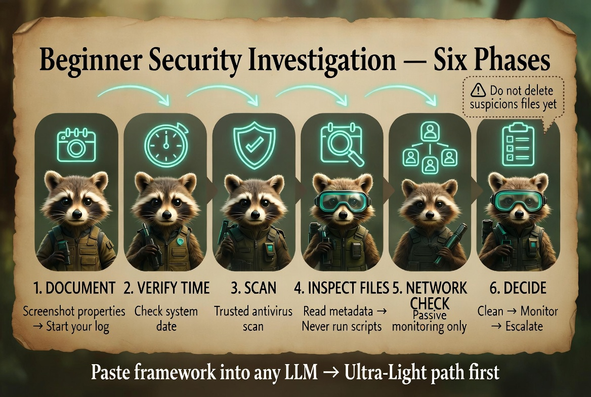

# My Security Investigation Framework - Linux
**Version:** 1.1 - Minimal Tools & Low-Token Optimized (2026-06-24)  
**Purpose:** Paste this entire file at the start of any LLM conversation (including free-tier or local models). Then describe your current situation. Designed for Linux users wanting maximum accessibility with minimal tools and low token usage across common distributions.

<p align="center">
  
</p>

*Infograph — [full gallery](../../Infographs/README.md) · [Quick Start](../../Start-Guide/Quick-Start-Guide.md)*

---

## Optimized for Low-Token & Minimal Tools Use

**This version prioritizes:**
- Built-in Terminal commands available on most Linux distributions
- Short, directive LLM prompts
- Clear Ultra-Light Path using only standard tools (no extra packages required initially)
- Works excellently with local LLMs (Ollama, etc.)

**Ultra-Light Path (Recommended when tokens or tools are limited):**
Phase 0 → Phase 1 (built-in checks) → Phase 2 (Terminal commands) → Phase 4

Add tools like `clamav`, `rkhunter`, or Wireshark only if the light path indicates a need.

**Note:** Linux distributions vary. Commands below are chosen for broad compatibility (tested patterns on Debian/Ubuntu, Fedora, and Arch-based systems). Adjust package manager commands (`apt`, `dnf`, `pacman`, etc.) as needed for your distro.

---

## Crisp Goal Statement
Guide a Linux user through safe, evidence-first investigation of suspicious files (future timestamps, weird flags, possible targeted scare tactics) and basic network activity using mostly built-in terminal tools and minimal token overhead.

## Success Criteria
- User produces a clear investigation log.
- Guidance remains calm, actionable, and low-token.
- Works on free-tier or local LLMs.
- User knows when to escalate professionally.

## Hard Invariants (Never Break)
- Never delete or alter suspicious files until fully documented and copied.
- Stay calm — scare tactics often rely on inducing mistakes.
- Work on copies when possible.
- Escalate to professionals for confirmed targeting, data theft, or financial risk.
- This is educational self-help only — not certified forensics or legal advice.

## Key Files to Create
- `investigation_log.md` — Running dated notes and observations
- `suspicious_files_inventory.md` — List of concerning files with full paths, timestamps, and notes

## Phased Plan (Ultra-Light First)

**Phase 0: Document & Check Basics**  
Goal: Capture evidence and rule out simple causes (clock skew).  
Actions:
1. Use Terminal to inspect suspicious files (replace `/path/to/file`):
   ```bash
   stat "/path/to/file"
   ls -l "/path/to/file"
   file "/path/to/file"
   ```
   Take screenshots or copy the output.
2. Check system time:
   ```bash
   timedatectl status
   ```
   Correct if significantly wrong and note the change.
3. Create the two key files above.
4. Do **not** delete, move, or execute suspicious files yet.

**Comprehension Gate:** Documented symptoms and system time? Ready for scanning?

**Phase 1: Built-in / Minimal Package Checks (Ultra-Light)**  
Goal: Use what is already available or very easy to add.  
Actions:
- Check for unexpected running services/processes:
  ```bash
  ps auxf
  systemctl list-units --type=service --state=running
  ```
- Review recent system logs (systemd-based distros):
  ```bash
  journalctl -p err..alert -n 50
  ```
- If you want a lightweight malware scanner and it is not installed, you can add ClamAV later (`sudo apt install clamav` or equivalent). For now, focus on manual checks.

**Comprehension Gate:** Basic process and log checks done? Anything unexpected? Ready to inspect files in detail?

**Phase 2: File Inspection (Terminal Focused)**  
Goal: Examine timestamps and content safely.

Future timestamps can result from a wrong system clock or **timestomping** (deliberate change to hide activity).

Actions:
- For deeper timestamp info on a file:
  ```bash
  stat "/path/to/file"
  ls -l --time-style=full-iso "/path/to/file"
  ```
- For scripts/text files: Open with `less`, `cat`, or `nano` (read-only mode). Never execute unknown scripts.
- Paste relevant output into the LLM using the short prompt below.

**Short LLM Prompt (low token, copy-paste ready):**
```
You are a calm security helper for Linux. Analyze this file or command output for a non-expert:

[PASTE stat / ls / ps / journalctl OUTPUT OR SCRIPT CONTENT]

1. What stands out simply?
2. Any signs of tampering, obfuscation, persistence, or odd behavior?
3. Confidence (Low/Medium/High) and why?
4. Safest single next step?

Keep it short and non-alarmist.
```

**Comprehension Gate:** Inspected files? What did you learn? Ready for network check?

**Phase 3: Basic Network Check (Minimal Tools)**  
Goal: Quick visibility using standard Terminal commands.

**Ultra-Light Version:**
Run these common commands and note output:
```bash
ss -tuln                  # Listening ports (modern replacement for netstat)
ss -tulnpe                # With process info (may need sudo)
lsof -i -n -P | head -30
ps aux | grep -v grep
```
Look for unexpected listening ports or unknown processes.

**Deeper Version (Optional):**  
Install Wireshark or `tcpdump` only if light checks show concerning traffic. Capture with `tcpdump -i any -w capture.pcap` for 5 minutes of normal activity.

**Short LLM Prompt for Network Output:**
```
You are a calm security helper. Review this Linux Terminal output:

[PASTE OUTPUT HERE]

Flag any suspicious listening ports, unknown processes, or odd connections. Keep explanation simple. Suggest one next command if useful.
```

**Comprehension Gate:** Network commands run? Anything odd? Ready to decide next steps?

**Phase 4: Decide & Escalate**  
Combine findings:
- Clean results + timestamps explained by clock → Strengthen basics (keep system updated, review services with `systemctl`, use strong unique passwords + 2FA, enable firewall with `ufw` or `firewalld`).
- Clear anomalies or targeted files → Document thoroughly. Consider professional incident response or law enforcement if this involves personal targeting or harassment.
- Unsure → Continue light monitoring (repeat Phase 3 periodically) and keep logging.

**Comprehension Gate:** Current assessment? Need help drafting a clean escalation summary?

**Phase 5: Simple Ongoing Hygiene**
- Keep your distribution and packages updated (`sudo apt update && sudo apt upgrade` or equivalent).
- Regularly review running services and listening ports.
- Re-run light Terminal checks if new symptoms appear.
- Maintain your `investigation_log.md`.

---

## Optional Role Modes (Use Only If Helpful)
Tell the LLM: "Use [Mode] for this response."
- **Cyber-SQRRL Mode**: Educational structure and investigation pedagogy for progressive learning steps.
- **Rusty Mode**: Exact safe Terminal commands or small verifiable tests.
- **Crystal Mode**: Simple visual or checklist ideas.
- **Damian Mode**: Practical cybersecurity risk notes and escalation guidance.

---

## Context Handoff (End of Every Session)
Ask the LLM:
"Append a short dated summary to my investigation_log.md with: what we did, key findings, decisions made, and recommended next action."

---

## Ultra-Light Checklist (Copy This Section Alone If Tokens Are Very Tight)

- [ ] Run `stat` and `ls -l` on suspicious files and record timestamps
- [ ] Check system time with `timedatectl status` and correct if needed
- [ ] Create investigation_log.md and suspicious_files_inventory.md
- [ ] Run: `ps auxf` and review for unexpected processes
- [ ] Check recent errors: `journalctl -p err..alert -n 50`
- [ ] For scripts: Open with `less` or `cat` only (never execute)
- [ ] Run these network commands and note output:  
  `ss -tuln`  
  `lsof -i -n -P | head -30`
- [ ] Use short LLM prompts for analysis
- [ ] Decide: Clean → basic hygiene | Concerning → document + consider professional help
- [ ] Keep logging

---

## Escalation & Professional Help

This framework is educational self-help — not certified digital forensics or legal advice. If you confirm data theft, financial impact, sophisticated persistence, or feel personally targeted, **stop DIY investigation** and read [When & How to Escalate](../../Start-Guide/When-and-How_to-Escalate.md). Your investigation log, file inventory, and network captures become your evidence package for professionals.

## Sources (Short)
- Standard Linux terminal tools (`stat`, `ss`, `lsof`, `ps`, `journalctl`) are reliable and widely available.
- Timestomping is a documented anti-forensic technique in digital forensics literature.
- This is educational self-help guidance only. Escalate confirmed incidents to professionals.

**Next Step When Starting:**
Paste this whole file into a new chat, then say:  
"Current situation: [your symptoms]. I want the Ultra-Light Path on Linux. Start with Phase 0."

---

**End of My Security Investigation Framework - Linux v1.1 - Minimal Tools & Low-Token Optimized**

This version is intentionally lightweight and distribution-friendly while remaining safe and effective. Update the version number when you improve it. Released for open-source personal safety use.